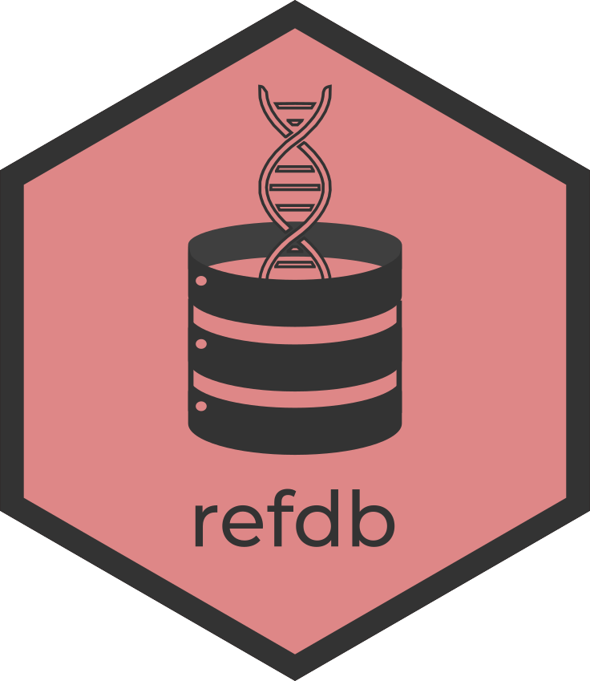

# refdb: A reference database manager for R

<!-- badges: start -->
[](https://codecov.io/gh/fkeck/refdb?branch=main)
<!-- badges: end -->

The refdb package is a reference database manager offering a set of powerful functions to import, organize, clean, filter, audit and export reference genetic data. It has been designed as an environment for semi-automatic and assisted construction of reference databases and to improve standardization and repeatability in metabarcoding studies.


## Installation

You can install the development version of refdb from GitHub. Note that you also need the development version of bioseq installed.


``` r
remotes::install_github("fkeck/bioseq")
remotes::install_github("fkeck/refdb")
```

This is an alpha version, use with care. Please report issues [here](https://github.com/fkeck/refdb/issues).

